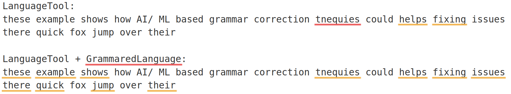

<p align="center">
    <b>If you find this project useful, please give it a ⭐ &mdash; and contributions are always welcome! 🤗</b><br>
</p>


# Grammared Language 🚀

<p align="center">
    <picture>
        <source src="assets/typewriter_beaver.png">
        
    </picture>
</p>
<h3 align="center">
    <p>✨ Adding Grammarly (and other) open source models to LanguageTool ✨</p>
</h3>


## Demo 🎬



Try it live: [https://grammared-language-demo.rayliu.ca/v2](https://grammared-language-demo.rayliu.ca/v2) 🌐

> ⚠️ **Heads up:** Demo server is running on an Oracle ARM CPU server. It might be a bit slow—patience is a virtue! 🐢


## Overview 📝

LanguageTool is a fantastic open-source grammar and spell-checking tool that mostly uses deterministic rules (with a sprinkle of n-grams).

One of the most common requests is to add support for smarter, self-hosted, AI/ML-based models. While not documented, LanguageTool *does* support remote correction servers via gRPC (see [GRPCRule](https://github.com/languagetool-org/languagetool/blob/1d1608b353120b325495f7ba804e322f747d92e7/languagetool-core/src/main/java/org/languagetool/rules/GRPCRule.java)), configured by the [remoteRulesFile](https://github.com/languagetool-org/languagetool/blob/1d1608b353120b325495f7ba804e322f747d92e7/languagetool-commandline/src/main/java/org/languagetool/commandline/CommandLineOptions.java#L309C12-L309C27) option in the `server.properties` config file.

This project is that missing remote server! It connects LanguageTool to open-source grammatical error correction models—mainly Grammarly's GECToR and CoEdIT—because they're fast, open, and get the job done. 💪


## Limitations ⚠️
- All corrections show up as "grammar" corrections (LanguageTool doesn't use the categories from remote servers)
- No paraphrasing support (LanguageTool clients use a hardcoded rewrite server URL)


## Supported Models 🧠
- `GECToR` models from [gotutiyan/gector](https://github.com/gotutiyan/gector)
- `text2text-generation` models (e.g., Grammarly's [CoEdIT](https://huggingface.co/collections/grammarly/coedit))


## Quick Start ⚡

### Model Config

#### Config File

Check out `model_config.yaml` or `docker/default_model_config.yaml` for a template:

```yaml
gector_deberta_large:
    type: gector
    backend: triton
    serving_config:
        triton_host: triton-server
        triton_port: 8001
        pretrained_model_name_or_path: "gotutiyan/gector-deberta-large-5k"
        triton_model_name: gector_deberta_large
        device: cuda # cpu, cuda, or auto
```


#### Environment Variable

Or set things up with environment variables (see `demo-docker-compose.yml` for real-world examples):


```
# See the 'environment:' section in demo-docker-compose.yml for full model config via env vars
# Example:
GRAMMARED_LANGUAGE__MODELS__GECTOR_DEBERTA_LARGE__TYPE=gector
GRAMMARED_LANGUAGE__MODELS__GECTOR_DEBERTA_LARGE__BACKEND=triton
GRAMMARED_LANGUAGE__MODELS__GECTOR_DEBERTA_LARGE__SERVING_CONFIG__TRITON_HOST=triton-server
...
```


For more details, see the comments in `grammared_language/utils/config_parser.py`.


### LanguageTool Integration 🛠️

To enable remote servers with LanguageTool, you'll need a remote rule config file. Point to it with the `remoteRulesFile` option in your `server.properties` file:

---


## How config loading works 🧩

When the service starts, it loads model configuration in this order:

1. If `/model_config.yaml` exists, it loads that.
2. If not, and environment variables starting with `GRAMMARED_LANGUAGE__` are set, it loads config from those (see `demo-docker-compose.yml`).
3. If neither is found, it falls back to `/default_model_config.yaml`.

See the `get_config` function in `grammared_language/utils/config_parser.py` for the nitty-gritty.

---

### 🚢 Start everything with Docker Compose:

```bash
docker-compose up --build
```
This runs Triton, the API, and (optionally) LanguageTool with remote rules. Easy!

---


## Requirements 📦

- Python 3.11+
- Docker (for containers)
- [Triton Inference Server](https://github.com/triton-inference-server/server) (for model serving)
- See `pyproject.toml` for more


## Usage 🏃

### LanguageTool Integration

To use remote servers with LanguageTool:

1. Set up a remote rule config file (see `example_language_tool_configs/remote-rule-config.json`).
2. Add this to your `server.properties`:

    ```
    remoteRulesFile=./remote-rule-config.json
    ```

3. Run:

    ```
    java -cp languagetool-server.jar org.languagetool.server.HTTPServer --config server.properties
    ```

#### With Dockerized LanguageTool 🐳

If you're using the `meyay/languagetool` or `erikvl87/languagetool` Docker images, set:

```
langtool_remoteRulesFile=<remote file config path in docker>
```

See `docker-compose.yml` for a full example.


## Troubleshooting 🛠️

- Model loading or inference errors? Check Triton and API logs.
- LanguageTool not working? Double-check your remote rule config is correct and accessible.


---


## Vibe Coding Notice 🎨

- One key learning objective of this project is to explore the use of various vibe coding models and tools
    - which is probably why you might see the code quality to be a bit patchy
- Bugs and rough edges are expected, use at your own risk


## Credits & References 🙏

- [GECToR: Grammatical Error Correction: Tag, Not Rewrite](https://github.com/gotutiyan/gector)
- [Grammarly CoEdIT models](https://huggingface.co/collections/grammarly/coedit)
- [Triton Inference Server](https://github.com/triton-inference-server/server)
- [LanguageTool](https://languagetool.org/)


